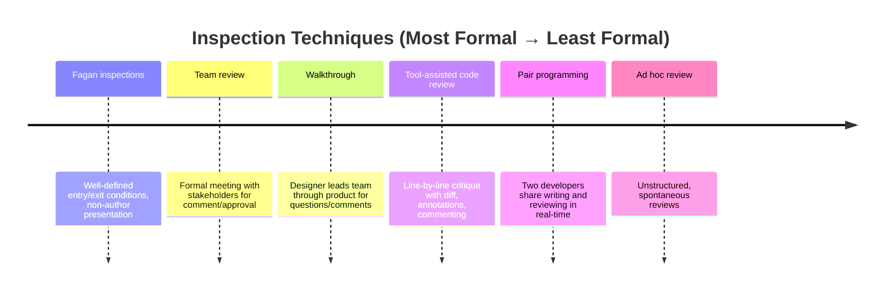

# Inspection

{: .important }
> For comprehensive coverage of software inspection, see the dedicated **[Inspection section](../inspection/)**.

## Overview

**Inspection** is the systematic scrutiny of development artifacts (code, design documents) by individuals other than the creator. It is consistently shown to be the **most cost-effective defect removal technique**, with detection rates of 60-90% .

### Key Benefits

| Benefit | Evidence |
|---------|----------|
| Early defect detection | 90% of lifecycle defects found (IBM) |
| Cost-effectiveness | 1:10 to 1:34 cost ratio vs. testing |
| ROI | 10:1 (HP), $21.4M annual savings |

---

## Detailed Topics

The [Inspection section](../inspection/) covers:

| Topic | Description |
|-------|-------------|
| [Fagan Inspection Process](../inspection/fagan-process.md) | The 6-step formal process and 4 roles |
| [Reading Techniques](../inspection/reading-techniques.md) | PBR, checklist, and scenario-based approaches |
| [Capture-Recapture Method](../inspection/capture-recapture.md) | Statistical defect estimation |
| [Effectiveness Data](../inspection/effectiveness.md) | Cost/benefit synthesis across studies |

---

## Technique Family

> *Adapted from K. Wiegers, Peer Reviews in Software (2002) *

---

### References



---

{: .highlight }
**Disclaimer:** AI is used for text summarization, polishing and explaining. Authors have verified all facts and claims. In case of an error, feel free to file an issue.
