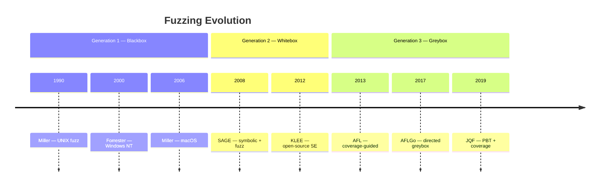
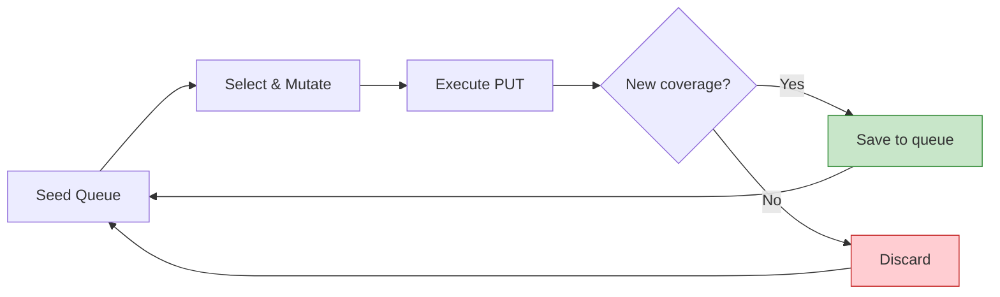

# Fuzz Testing

Fuzz testing (fuzzing) feeds programs with randomly generated or mutated inputs to discover crashes, hangs, and security vulnerabilities. From its origins as a class project in 1990, fuzzing has evolved into the dominant automated vulnerability discovery technique used by Google, Microsoft, and the broader security community.

---

## Definition

> "Fuzzing is the execution of the PUT [program under test] using input(s) sampled from an input space that protrudes the expected input space of the PUT." 

A fuzzer generates inputs that include **unexpected, malformed, or boundary values** — not just valid inputs that happen to be randomly chosen. The goal is to find inputs that trigger undefined behavior, crashes, or security violations.

---

## The Fuzzing Lifecycle

Takanen et al. describe a six-phase practitioner workflow for systematic fuzz testing :

| Phase | Activity | Key Considerations |
|-------|----------|--------------------|
| 1. **Identify interfaces** | Enumerate all network sockets, file formats, APIs the target accepts | Attack surface determines fuzzing scope |
| 2. **Generate inputs** | Create anomalous data via mutation or generation from a model | Generation-based reaches deeper logic; mutation-based is easier to set up |
| 3. **Send to target** | Deliver fuzzed data to the system's interfaces | May require session management for stateful protocols |
| 4. **Monitor** | Check for crashes, hangs, performance degradation, memory corruption | From simple availability checks to full sanitizer instrumentation |
| 5. **Analyze exceptions** | Determine which input caused which fault; bucket crashes by uniqueness | Crash bucketing prevents duplicate reports |
| 6. **Report** | Prepare reproducible test cases for developers | Small binaries or scripts to reproduce each bug |

This practitioner lifecycle complements the academic taxonomy of Manes et al. (PREPROCESS → SCHEDULE → INPUTGEN → INPUTEVAL → CONFUPDATE) by emphasizing operational concerns: interface enumeration, monitoring depth, and defect reporting .

---

## Three Generations of Fuzzing



### Generation 1: Blind Random Fuzzing (1990-2000)

Miller's landmark studies established fuzzing through pure random input generation:

**UNIX utilities (1990)**: Miller's approach was disarmingly simple :

```bash
# Generate random bytes and pipe them into a utility
cat /dev/urandom | head -c 100000 | program_under_test
# If the program crashes or hangs → bug found
```

25-33% of utilities on seven UNIX variants crashed or hung. The failures exposed fundamental programming errors: pointer and array bounds violations, unchecked return values, race conditions, and signed character handling bugs.

**Windows NT (2000)**: Extended to GUI applications — 21% of tested applications crashed and 24% hung on random valid Win32 messages; 100% failed on random raw messages . The study exposed a systematic Win32 API flaw: applications could not distinguish window messages from the OS versus those from other programs, creating an inherent vulnerability.

**macOS X (2006)**: Command-line reliability improved to 7% crash rate (down from 33%), but GUI failure rate reached 73% — the worst ever recorded .

**The longitudinal finding**: The same error classes — buffer overflows, null pointer dereferences, unchecked return values — persisted for 16 years across operating systems. Simple random testing continues to find bugs that sophisticated techniques miss .

### Generation 2: Whitebox Fuzzing (2000-2013)

**SAGE** (Scalable Automated Guided Execution) at Microsoft combined symbolic execution with fuzzing :

- Executes the program concretely, records path constraints, negates constraints to generate new inputs that explore different paths
- Found **one-third of all file-fuzzing bugs** during Windows 7 development
- Scale: 400 machine-years of computation, 3.4 billion constraints solved
- Caught bugs missed by both static analysis and blackbox fuzzing

SAGE showed that "the art of constraint generation is as important as the art of constraint solving" — how you model program behavior matters as much as the solver's power .

### Generation 3: Coverage-Guided Greybox Fuzzing (2013-present)

Modern greybox fuzzers use lightweight instrumentation to measure code coverage, then evolve inputs that reach new program states.

**The AFL model**: American Fuzzy Lop (AFL, 2013) introduced edge-based coverage measurement combined with an evolutionary algorithm :



A 1% increase in coverage correlates with 0.92% more bugs found .

**What mutation looks like** — AFL takes a seed input and applies small changes:

```
Original seed: "GET /index.html HTTP/1.1\r\n"
Bit flip:      "GET /index.htm\xec HTTP/1.1\r\n"   ← flipped one bit
Arithmetic:    "GET /index.html HTTP/2.1\r\n"       ← incremented '1' → '2'
Block delete:  "GET HTTP/1.1\r\n"                   ← removed a chunk
```

If any mutated input triggers a new code edge, it joins the queue for further mutation.

**Directed greybox fuzzing (AFLGo)**: Böhme et al. extended greybox fuzzing with distance-based guidance via simulated annealing, directing the fuzzer toward specific program locations . AFLGo exposed Heartbleed in under 20 minutes where Katch (symbolic execution) failed in 24 hours, and found 26 bugs in OSS-Fuzz targets including 17 CVEs.

### Generation-Based vs Mutation-Based Fuzzing

Orthogonal to the three generations, fuzzers differ in how they create inputs :

| Approach | How it works | Strengths | Weaknesses |
|----------|-------------|-----------|------------|
| **Mutation-based** | Takes valid samples and applies anomalies (bit-flip, byte-flip, block deletion) | Easy to set up, no model required | Seed quality is critical; shallow coverage |
| **Generation-based** | Creates inputs from scratch using a grammar or protocol model | Deeper coverage (25.5% vs 10.5-14.9% on libpng); finds ~15% more bugs | Requires building a model of the input format |

An independent evaluation found that running multiple different fuzzers on the same target typically finds **50% more bugs** than any single tool in isolation . This validates the practice of combining mutation-based and generation-based fuzzers in production fuzzing campaigns.

---

## Fuzzing Taxonomy

Manes et al. present a unified model with five core functions :

| Function | Purpose | Examples |
|----------|---------|----------|
| **PREPROCESS** | Instrumentation, seed selection | Compile-time instrumentation, minset computation |
| **SCHEDULE** | Pick next configuration to fuzz | Power schedules (AFLFast), distance-based (AFLGo) |
| **INPUTGEN** | Generate test input | Mutation (bit-flip, arithmetic), generation (grammar-based) |
| **INPUTEVAL** | Execute and detect bugs | Crash detection, sanitizers, coverage measurement |
| **CONFUPDATE** | Update fuzzer state | Add to queue if new coverage, update energy |

### By Knowledge Level

| Type | Knowledge | Overhead | Strengths |
|------|-----------|----------|-----------|
| **Black-box** | None (I/O only) | Minimal | Simple, fast, no source needed |
| **Grey-box** | Coverage feedback | Low (~5-20%) | Best throughput-to-insight ratio |
| **White-box** | Full program analysis | High | Systematic path exploration |

---

## Bug Oracles for Fuzzing

The oracle determines what bugs a fuzzer can find :

| Oracle | Detects | Overhead |
|--------|---------|----------|
| **Crash signal** | Segfaults, abort | None |
| **AddressSanitizer (ASan)** | Buffer overflow, use-after-free, double-free | ~73% |
| **UndefinedBehaviorSan (UBSan)** | Integer overflow, null deref, alignment | ~20% |
| **ThreadSanitizer (TSan)** | Data races, deadlocks | ~5-15x |
| **MemorySanitizer (MSan)** | Uninitialized memory reads | ~3x |

---

## Evaluating Fuzzers

Klees et al. established critical benchmarking standards after finding widespread methodological problems in fuzzing research :

| Problem | Evidence | Recommendation |
|---------|----------|----------------|
| Single-run evaluations | 56% of papers used one run | **30+ independent trials** |
| Crash ≠ bug | 57,142 AFL "unique crashes" → 9 actual bugs | **Ground truth measurement** |
| Short campaigns | Performance rankings reverse over time | **24-hour minimum timeout** |
| No statistical tests | Results may be due to randomness | **Mann-Whitney U test** |
| Seed sensitivity | Different seeds → different results | **Report seed selection methodology** |

---

## Fuzzing Metrics

Beyond code coverage, Takanen et al. identify four levels of measurement for evaluating fuzzing completeness :

| Level | What It Measures | Example |
|-------|-----------------|---------|
| **Specification coverage** | % of protocol/file format standard exercised | "Tested 85% of HTTP/1.1 RFC header fields" |
| **Input space coverage** | Range of values provided to each interface element | Heuristic bounds on theoretically infinite space |
| **Interface coverage** | Which communication interfaces (ports, APIs, parsers) are tested | 12 of 15 network ports fuzzed |
| **Code coverage** | Structural execution (lines, branches, edges) | 73% branch coverage under fuzzing |

Operational metrics complement coverage: **failure efficiency** (percentage of tests resulting in a crash) and **defect efficiency** (unique bugs discovered per hour of fuzzing). The **pesticide paradox** applies — the more software is tested with one fuzzer, the more "immune" it becomes, requiring rotation to new techniques .

---

## Fuzzing in Industry

Fuzzing has moved from research labs to standard industry practice :

| Target | Result | Source |
|--------|--------|--------|
| Microsoft Office 2010 | **1,800 bugs** found and fixed through fuzzing | Microsoft SDL |
| WiFi access points | **80%** of 7 tested devices failed DHCP fuzzing | Protocol fuzzing study |
| Bluetooth implementations | **25 of 30** crashed under protocol fuzzing | PROTOS project |

**Cost-benefit**: Finding a bug during development is approximately **100x cheaper** than fixing it after delivery. The Return on Security Investment (ROSI) framework justifies fuzzing investment when cost of tool + testing < expected cost of compromise × probability .

**Commercial tools** have grown alongside open-source fuzzers: Defensics (evolved from the PROTOS research project; model-based), beSTORM (automatic protocol analysis), and Mu-4000 (hardware appliance with sophisticated monitoring). Large enterprises in telecom and finance now require proof of fuzz testing from vendors.

---

## The Convergence with Property-Based Testing

Pure fuzzing mutates bytes without understanding input structure. Property-based testing generates structured inputs without coverage feedback. **JQF** bridges both paradigms : coverage-guided mutation of structured inputs.

Where pure random testing failed to find a Trie bug in 7 million+ executions, Zest (coverage-guided) found it in approximately 5,000 executions — a **1,000x improvement** .

See [Property-Based Testing](property-based) for the full PBT story.

---

### References



---

{: .highlight }
**Disclaimer:** AI is used for text summarization, polishing and explaining. Authors have verified all facts and claims. In case of an error, feel free to file an issue.
