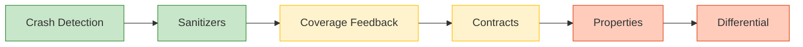

# Random Testing

Random testing generates test inputs by sampling from input spaces rather than deriving them from specifications or code structure. Despite early dismissal as a "poor methodology," decades of research demonstrate that random testing — with proper feedback, oracles, and tool support — is one of the most effective and scalable approaches to finding software defects.

---

## Why Random Testing?

Systematic testing strategies require human judgement to select inputs. That judgement introduces bias: testers exercise the cases they anticipate, missing the unexpected interactions that cause real failures. Random testing bypasses this bias entirely.

The empirical evidence is compelling:

- **Miller's 16-year fuzz series** found that 25-33% of UNIX utilities crashed on random input , and the same error classes persisted for over a decade 
- **Randoop** found 30 errors in a .NET component already tested by 40 engineers for 5 years — more than a tester typically finds in a year 
- **QuickCheck** discovered bugs in production Haskell libraries with a 300-line tool, finding errors equally distributed across generators, specifications, and implementations 

Random testing also uniquely supports **statistical reliability prediction**: after N successful random tests drawn from an operational profile, one can bound the probability of undetected failure .

---

## The Oracle Problem

Generating millions of inputs is easy. Knowing whether each output is *correct* is the hard part. The oracle mechanism determines what class of bugs random testing can find:

| Oracle Type | Mechanism | Catches | Misses |
|-------------|-----------|---------|--------|
| **Crash detection** | Program crashes or hangs | Reliability failures, memory corruption | Semantic bugs |
| **Sanitizers** | ASan, UBSan, TSan | Buffer overflows, undefined behavior, data races | Logic errors |
| **Contracts** | Preconditions, postconditions, invariants | Specification violations | Unspecified behavior |
| **Properties** | User-defined invariants for all inputs | Logical errors, corner cases | Requires developer specification effort |
| **Coverage feedback** | New code paths = interesting input | Guides exploration toward new behavior | Does not verify correctness |
| **Differential** | Compare against reference implementation | Any divergence from reference | Shared bugs in both implementations |

*Left to right: more automated but less precise → more precise but requires more effort.*

The evolution from crash oracles  to sanitizer-augmented coverage  to specification-based properties  represents a trade-off between **automation and precision** .

---

## Random vs. Partition Testing

A persistent question in testing theory: does systematic partition testing outperform random testing?

The debate has a nuanced resolution :

- **Random wins** when no meaningful partition exists, cost matters, operational profile testing is needed, or stateful systems require sequence testing 
- **Partition wins** when subdomains are genuinely homogeneous and cost-weighted failure rates vary significantly across subdomains 
- **The gap is small**: roughly 20% more random tests erase any partition advantage , and just 1-2 additional random tests can tilt the balance at scale 

The practical answer: combine both — random testing first for broad coverage and reliability estimation, followed by targeted systematic testing for edge cases .

---

## Topics in This Section

### [Fundamentals](fundamentals)
Theory of random testing, reliability prediction, sampling strategies, and feedback-directed tools (Randoop, AutoTest).

### [Fuzz Testing](fuzzing)
From Miller's 1990 UNIX study through whitebox fuzzing (SAGE) to modern coverage-guided greybox fuzzers (AFL, AFLGo).

### [Property-Based Testing](property-based)
QuickCheck's paradigm of executable specifications, Hypothesis for Python, JQF's convergence with fuzzing, and industry adoption.

### [Mutation Testing](mutation)
Test adequacy via fault seeding: operators, mutation score, the equivalent mutant problem, cost reduction, and LLM-assisted detection.

---

## Key Numbers

| Fact | Value | Source |
|------|-------|--------|
| UNIX utility crash rate (1990) | **25-33%** on random input | Miller 1990 |
| Randoop vs. manual testing | **100x** more errors per human hour | Pacheco 2007 |
| Coverage guidance improvement | **1000x** fewer executions to find bugs | Padhye 2019 |
| Equivalent mutants in practice | **10-40%** of all mutants | Jia & Harman 2011 |
| PBT practitioner time budgets | **50ms-30s** per property | Goldstein 2024 |

---

## Further Exploration

- [Coverage Criteria](../coverage/) — How to measure test thoroughness
- [Input Domain Testing](../domain/) — Systematic black-box partitioning techniques
- [Combinatorial Testing](../combinatorial/) — Interaction coverage for parameter combinations
- [Industry Case Studies](../../organization/05-practice/07-industry-case-studies) — Chaos engineering and resilience testing in practice

---

### References



---

{: .highlight }
**Disclaimer:** AI is used for text summarization, polishing and explaining. Authors have verified all facts and claims. In case of an error, feel free to file an issue.
