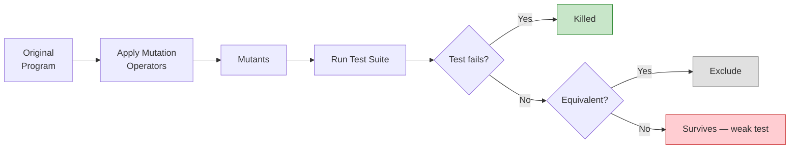

# Mutation Testing

Mutation testing measures the fault-detection effectiveness of a test suite by introducing small, deliberate changes (mutants) into the program and checking whether existing tests catch them. It answers a fundamental question: **if a bug were present, would your tests find it?**

For an introduction to mutation operators and mutation score, see [Mutation Coverage](../coverage/mutation).



---

## Theoretical Foundations

DeMillo, Lipton, and Sayward introduced mutation testing through two key hypotheses :

### Competent Programmer Hypothesis

Programmers create programs that are "close to being correct" — faults are small syntactic changes from the intended program. This justifies testing for simple errors rather than arbitrary deviations.

**Example** — original function and three mutants:

```python
def classify(a, b, c):                  # Original
    if a == b == c:  return "equilateral"
    if a == b or b == c or a == c:  return "isosceles"
    return "scalene"

# Mutant 1 (ROR): a == b == c  →  a >= b == c     ← killed by (2,2,2)
# Mutant 2 (LCR): a==b or b==c →  a==b and b==c   ← killed by (3,3,5)
# Mutant 3 (equivalent!): swapping b==c and a==c   ← same behavior for all inputs
```

A test suite that kills Mutants 1 and 2 but cannot kill Mutant 3 (because it is **equivalent**) achieves a mutation score of 2/2 = 100%.

### Coupling Effect

> "Test data that distinguishes all programs differing from a correct one by only simple errors is so sensitive that it also implicitly distinguishes more complex errors." 

Empirical validation: test sets that killed all first-order mutants also killed over 99% of second- and third-order mutants . For Hoare's FIND algorithm, only 19 out of 22,000+ randomly generated complex-error mutants survived adequate test data — and all 19 were proven equivalent to the original .

### Practical Evidence

Seven carefully chosen test vectors for FIND achieved mutation adequacy, outperforming :
- 24 permutations (38 live mutants remained)
- 1,000 random permutations (10 live mutants remained)
- Exhaustive path coverage (insufficient without error-focused selection)

---

## Cost Reduction Techniques

Full mutation testing is computationally expensive: a program with N statements and M operators generates O(N × M) mutants, each requiring a full test suite execution. Three decades of research have produced effective cost reduction strategies :

### Selective Mutation

Not all operators contribute equally. Offutt discovered that **5 key operators** — ABS, UOI, LCR, AOR, ROR — achieve 99.5% of the mutation score of the full operator set :

| Operator | Name | Example |
|----------|------|---------|
| **ABS** | Absolute value insertion | `x` → `abs(x)` |
| **UOI** | Unary operator insertion | `x` → `−x`, `++x` |
| **LCR** | Logical connector replacement | `&&` → `\|\|` |
| **AOR** | Arithmetic operator replacement | `+` → `−`, `*` → `/` |
| **ROR** | Relational operator replacement | `>` → `>=`, `==` → `!=` |

### Random Sampling

Randomly selecting 10% of mutants reduces cost by 90% while losing only 16% effectiveness .

### Weak Mutation

Check mutant behavior immediately after the mutated statement executes rather than at program output. Faster but may miss mutants whose local state change does not propagate to output.

---

## The Equivalent Mutant Problem

Some mutants produce identical behavior to the original program for all possible inputs. These **equivalent mutants** cannot be killed by any test and must be identified and excluded from the mutation score calculation.

### Scale of the Problem

Empirical studies find 10-40% of mutants are equivalent . Automatically detecting all equivalent mutants is **undecidable** (reducible to the halting problem), making this the most persistent challenge in mutation testing.

**Concrete equivalent mutant** — for integer `x`, these two conditions are identical:

```python
if x > 0:   ...    # original
if x >= 1:  ...    # mutant — equivalent for all integers (no input can distinguish them)
```

### Detection Approaches

| Approach | Mechanism | Limitation |
|----------|-----------|------------|
| **Compiler optimization (TCE)** | If optimized mutant = optimized original, they are equivalent | Limited to optimizations the compiler performs |
| **Constraint solving** | Generate path constraints that distinguish mutant from original | Scalability limits on complex programs |
| **Program slicing** | If mutant is outside the backward slice of any output, it is equivalent | Conservative — may miss some equivalences |

### LLM-Assisted Detection

Tian et al. conducted the first large-scale study of LLMs for equivalent mutant detection on 3,302 Java mutant pairs :

| Approach | Best Model | F1-Score |
|----------|-----------|----------|
| **Fine-tuned code embeddings** | UniXCoder (110M params) | **86.58%** |
| **Pre-trained code embeddings** | UniXCoder | 82.18% |
| **Few-shot prompting** | GPT-4 | 55.90% |
| **Best baseline (non-LLM)** | ASTNN | 70.00% |

Key findings:
- LLMs achieve 35.69% average F1-score improvement over existing techniques
- **Smaller code-specific models outperform larger general models** — UniXCoder (110M parameters) beats GPT-4 and text-embedding models
- Prompting alone is insufficient; fine-tuning on code embeddings is necessary
- Inference time is acceptable: 0.0431 seconds per mutant pair 

---

## Mutation Testing in Practice

Smith and Williams studied how testers perform mutation analysis in practice :

| Metric | Value |
|--------|-------|
| Coverage improvement | 2-9% statement coverage gain in 60 minutes |
| Test creation rate | ~1 new test every 6 minutes |
| Analysis time | Killed mutants: 267s; ignored mutants: 313s |
| DOA mutants | 43 of 98 mutants killed by existing tests (Dead on Arrival) |

### Operator Effectiveness

Not all operators produce equally useful mutants. COR, COI, and COD operators were most effective for Java backend code, while EAM produced 560 mutants but most were DOA .

### The "Crossfire" Phenomenon

A single new test case often kills multiple mutants simultaneously, suggesting significant operator redundancy .

### Practitioner Assessment

Testers view mutation analysis as "effective but relatively expensive" . The manual source examination forced by mutation analysis — finding the mutant location, understanding the change, writing a killing test — may itself be more valuable than purely automated test generation.

---

## The Mutation Testing Arc

```
DeMillo 1978 — Theory (coupling effect, competent programmer hypothesis)
    ↓
Jia & Harman 2011 — Maturity (390+ papers, 36 tools, validated theory)
    ↓
Smith 2009 — Practice (feasible but expensive, operator selection matters)
    ↓
Tian 2024 — LLM frontier (86.58% F1 on equivalent mutant detection)
```

### Field Maturity

Jia and Harman's comprehensive survey of 390+ papers documented the field's transition from theory to practice :

- **36 mutation tools** developed (7 open source, 3 commercial after 2000)
- **Exponential publication growth** (R² = 0.77 correlation with year)
- Practical publications surpassed theoretical in 2006
- Mutation criteria **probsubsumes** all-use data flow coverage
- Mutation-adequate test sets detect **16% more faults** than all-use adequate sets

---

## Modern Tools

| Tool | Language | Key Feature |
|------|----------|-------------|
| **PIT** (pitest.org) | Java | JUnit integration, bytecode mutation, incremental analysis |
| **Stryker** | JavaScript/C# | Multi-language support, dashboard reporting |
| **mutmut** | Python | Pytest integration, survivor analysis |
| **Mull** | C/C++ | LLVM-based, fast compilation |
| **Cosmic Ray** | Python | Distributed mutation, operator selection |

---

### References



---

{: .highlight }
**Disclaimer:** AI is used for text summarization, polishing and explaining. Authors have verified all facts and claims. In case of an error, feel free to file an issue.
