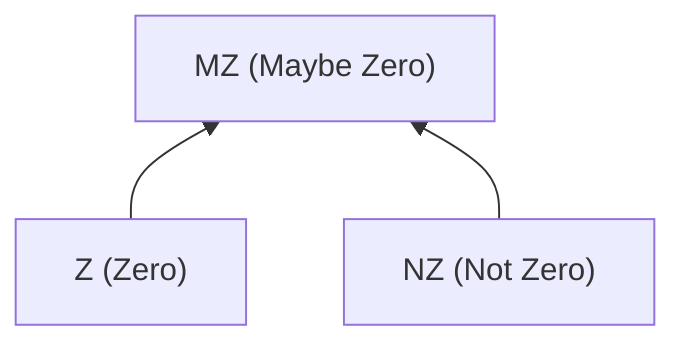
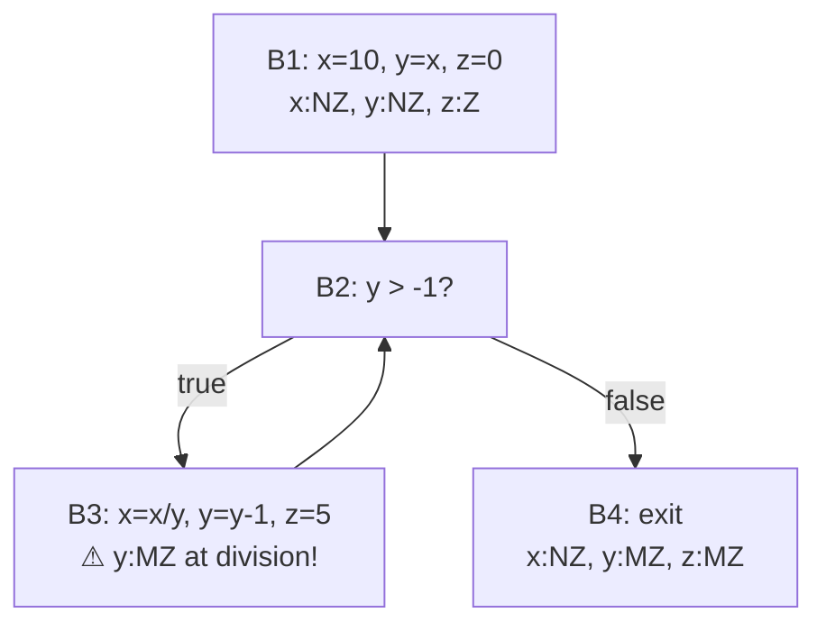

# Dataflow Analysis

Dataflow analysis tracks how variable states and values propagate through program execution paths, detecting bugs that simpler techniques cannot. While AST pattern matching finds local issues within a single expression or statement, dataflow analysis reasons about how information flows across statements, branches, and loops .

---

## What is Dataflow Analysis?

**Dataflow analysis** computes facts about program variables at each point in the program by propagating information along the edges of the Control Flow Graph (CFG). The key insight is that the *order* of statements and the *paths* through which execution can flow both matter.

**Core questions dataflow analysis answers:**
- Did you read from a file after closing it?
- Could `null` flow to a dereference point?
- Could the divisor be zero at this division?
- Is this variable ever used after being assigned?

### Forward vs. Backward Analysis

| Direction | Propagates | Examples |
|-----------|-----------|----------|
| **Forward** | Facts from definitions toward uses | Reaching definitions, available expressions, zero analysis |
| **Backward** | Facts from uses toward definitions | Live variables, very busy expressions |

**Forward analysis** starts at the program entry and asks "what facts hold here, given what happened before?" **Backward analysis** starts at program exit and asks "what facts are needed here, given what happens later?"

---

## Zero Analysis: A Complete Walkthrough

Zero analysis detects potential **divide-by-zero** errors by tracking whether variables are definitely zero, definitely non-zero, or unknown. This example demonstrates all the core concepts of dataflow analysis: abstract domains, lattices, transfer functions, and fixed-point computation.

### Abstract Domain

Instead of tracking exact integer values (impossible in general), we abstract them into three categories:

| Concrete Values | Abstract Value | Meaning |
|----------------|----------------|---------|
| 0 | **Z** (Zero) | Definitely zero |
| Any n where n != 0 | **NZ** (Not Zero) | Definitely not zero |
| Unknown | **MZ** (Maybe Zero) | Could be either |

This is the key idea of **abstract interpretation**: replace infinite concrete domains with finite abstract domains that are tractable to analyze.

### Lattice

Abstract values form a **lattice** that defines how to combine information from different paths:



The **join** operation (written as a union symbol) combines abstract values when control flow paths merge:
- Z join NZ = MZ (if one path says zero and another says non-zero, the result is maybe-zero)
- Z join Z = Z
- NZ join NZ = NZ
- MZ join anything = MZ

**MZ** is the **top** element (least informative -- we know nothing). There is no bottom element in this simplified lattice.

### Transfer Rules

Each statement transforms the abstract state according to **transfer functions**:

| Statement | Input State | Output State | Rationale |
|-----------|-------------|--------------|-----------|
| `x = 0` | any | x:Z | Literal zero assignment |
| `x = 10` | any | x:NZ | Non-zero literal |
| `x = y` | y:Z | x:Z | Copy preserves abstract value |
| `x = y` | y:NZ | x:NZ | Copy preserves abstract value |
| `x = y` | y:MZ | x:MZ | Copy preserves abstract value |
| `x = x - 1` | x:NZ | x:MZ | Subtracting 1 from non-zero might reach 0 |
| `x = x + 1` | x:Z | x:NZ | Adding 1 to zero is definitely non-zero |

### Step-by-Step Walkthrough

Consider this C program:

```c
x = 10;           // x:NZ
y = x;            // x:NZ, y:NZ
z = 0;            // x:NZ, y:NZ, z:Z
while (y > -1) {  // loop entry merges: y:NZ ⊔ MZ = MZ, z:Z ⊔ NZ = MZ
  x = x / y;      // WARNING: y is MZ (maybe zero)!
  y = y - 1;      // y becomes MZ (was MZ, subtraction keeps MZ)
  z = 5;          // z:NZ
}
// After loop: x:NZ, y:MZ, z:MZ
```

### CFG with Abstract States



**How the analysis proceeds:**

1. **Block B1:** Sequential assignments. After execution: x:NZ, y:NZ, z:Z.

2. **Block B2 (first visit):** State arrives from B1: {x:NZ, y:NZ, z:Z}. Condition `y > -1` does not change abstract state (our simple domain does not model comparison refinement for zero analysis).

3. **Block B3 (first iteration):** Division `x = x / y` with y:NZ is safe. Then `y = y - 1`: since y:NZ, subtracting 1 might make it zero, so y:MZ. Then `z = 5`: z:NZ. State leaving B3: {x:NZ, y:MZ, z:NZ}.

4. **Block B2 (second visit):** Now state from B1 and state from B3 must be **joined**:
   - x: NZ join NZ = NZ
   - y: NZ join MZ = MZ
   - z: Z join NZ = MZ

5. **Block B3 (second iteration):** Division `x = x / y` with **y:MZ** -- the divisor might be zero. **Report warning: potential divide-by-zero.**

6. **Fixed point:** The abstract state no longer changes between iterations. Analysis terminates.

> **Detection:** At `x = x / y` in B3, the divisor `y` has abstract value MZ. The analysis reports a warning for potential divide-by-zero. This is a genuine bug: when `y` counts down to 0, the loop condition `y > -1` is still true, and the division executes with y = 0.

---

## Null Pointer Analysis

The same framework applies to null pointer detection with a different abstract domain: **{Null, NotNull, MaybeNull}**.

```java
Integer x = new Integer(6);  // x:NotNull
Integer y = bar();           // y:MaybeNull (unknown return)
if (y != null) {
    // Branch refinement: y:NotNull in this branch
    z = x.intVal() + y.intVal();  // Safe: both NotNull
} else {
    z = x.intVal();               // Safe: x:NotNull
    y = x;                        // y:NotNull (copy from x)
    x = null;                     // x:Null
}
// After merge: x is Null ⊔ NotNull = MaybeNull
return z + x.intVal();            // ERROR: x is MaybeNull!
```

**Branch refinement** is a key feature of null analysis: when code checks `y != null`, the analysis can narrow `y` from MaybeNull to NotNull in the true branch and to Null in the false branch. This dramatically reduces false positives.

Facebook's **Infer** tool uses a sophisticated variant of this analysis based on **separation logic** to detect null dereferences and resource leaks at scale, running automatically on every code diff before it is submitted .

---

## Reaching Definitions

**Reaching definitions** analysis answers: "Where does this value come from?"

A definition `d: x = expr` at line `d` **reaches** a program point `p` if there exists a path from `d` to `p` along which `x` is not redefined. This builds **use-def chains** that link each use of a variable to all possible definitions that might have produced its value.

**Example:**
```c
d1: x = 5;        // definition d1
d2: x = y + 1;    // definition d2, kills d1
    if (cond) {
d3:     x = 0;    // definition d3, kills d2
    }
    use(x);        // reached by d2 and d3 (not d1)
```

**Applications:**
- **Dead code elimination:** If a definition reaches no uses, the assignment is dead code
- **Copy propagation:** If `x = y` is the only reaching definition, replace uses of `x` with `y`
- **Constant propagation:** If only constant definitions reach a use, fold the constant
- **Def-use chains:** Foundation for many compiler optimizations and refactoring tools

---

## Practical Applications

### Industrial Tools Using Dataflow Analysis

| Tool | Technique | Domain | Notable Feature |
|------|-----------|--------|-----------------|
| **Facebook Infer** | Separation logic | Null, resource leaks | Runs at diff time; compositional (analyzes changed files only) |
| **Coverity** | Inter-procedural dataflow | C/C++, Java | Industry standard; scales to millions of LOC |
| **Clang Static Analyzer** | Path-sensitive analysis | C/C++/Obj-C | Integrated in Xcode; free and open source |
| **SpotBugs** | Intraprocedural dataflow | Java bytecode | Null analysis, type confusion patterns |
| **Polyspace** | Abstract interpretation | C/C++ | DO-178C / ISO 26262 certification |

### How Tools Scale

Industrial dataflow analysis faces a fundamental tension between **precision** and **scalability**:

| Approach | Precision | Scalability | Example |
|----------|-----------|-------------|---------|
| **Intraprocedural** | Low (ignores function calls) | High | SpotBugs |
| **Context-insensitive** | Medium (one summary per function) | Medium | Early Coverity |
| **Context-sensitive** | High (per-callsite summaries) | Lower | Clang Static Analyzer |
| **Compositional** | High (incremental) | High | Facebook Infer |

Facebook Infer's compositional approach analyzes each function independently, producing summaries that can be reused when analyzing callers. This enables incremental analysis: when a developer changes one file, only that file and its direct dependents need re-analysis .

---

## Further Exploration

- [Analysis Techniques](techniques.md) -- Overview of all static analysis techniques and how dataflow fits in the continuum
- [Symbolic Execution](symbolic-execution.md) -- A deeper analysis technique that explores individual paths with constraint solving
- [Static Analysis Overview](./) -- The soundness-completeness tradeoff and why no technique is perfect
- [V&V Overview](../overview/) -- The broader landscape of verification and validation

---

### References



---

{: .highlight }
**Disclaimer:** AI is used for text summarization, polishing and explaining. Authors have verified all facts and claims. In case of an error, feel free to file an issue.
