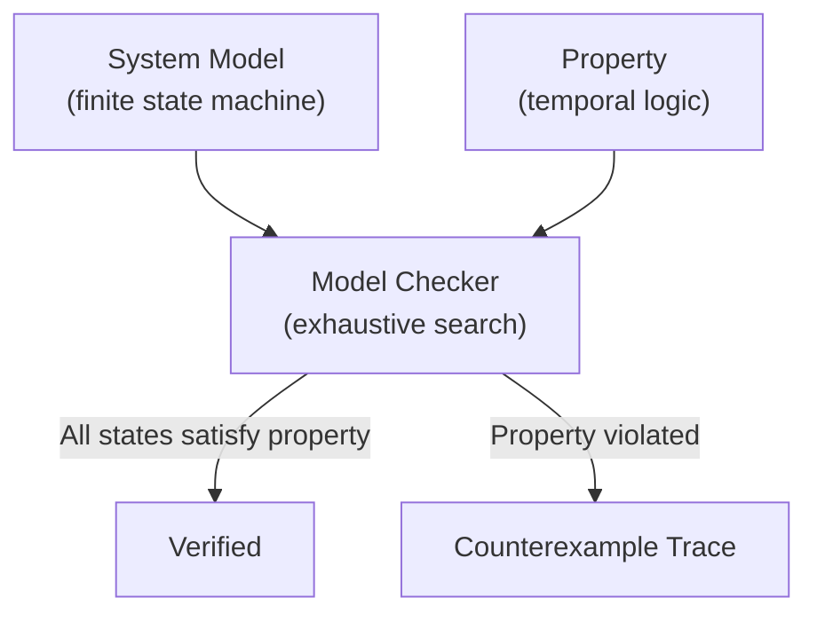
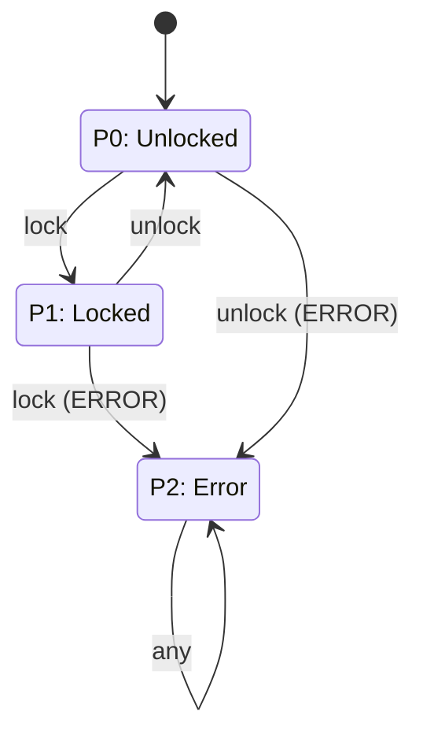
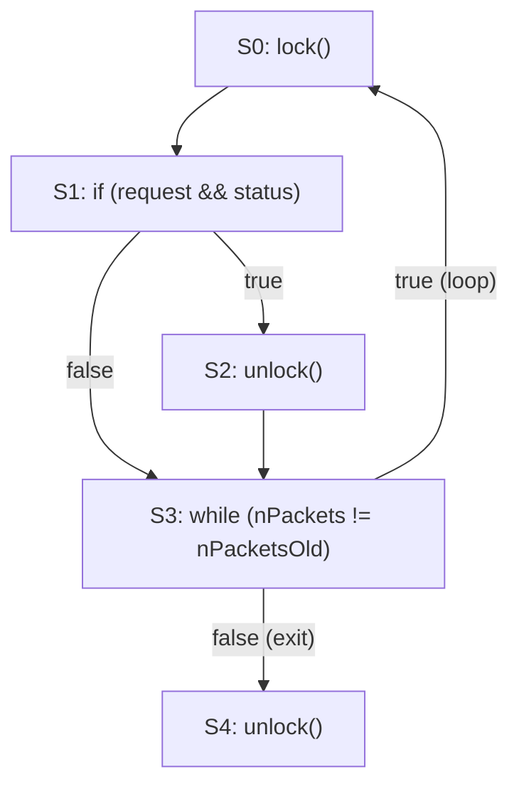
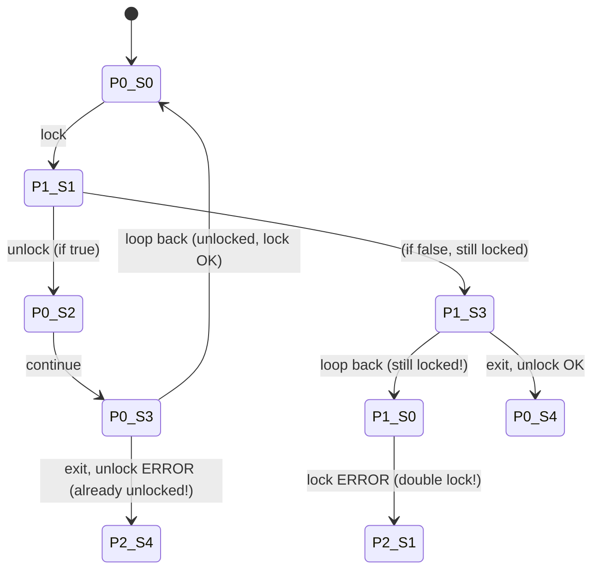
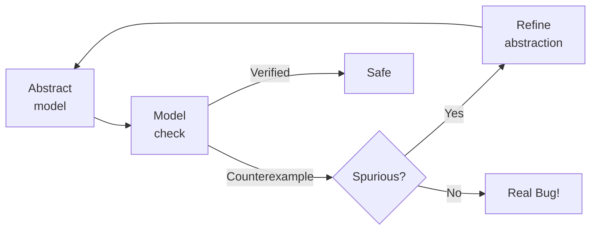

# Model Checking

Model checking is an algorithmic approach to formal verification that exhaustively explores all reachable states of a system to verify whether a given property holds. Unlike theorem proving, which requires manual proof construction, model checking is fully automated and produces **counterexample traces** when a property is violated -- making it one of the most practical formal methods available .

---

## What is Model Checking?

Model checking verifies a system by transforming both the program and its correctness property into finite automata, then systematically searching for a computation that violates the property. The technique was invented by Edmund Clarke, Allen Emerson, and Joseph Sifakis, who received the 2008 Turing Award for this contribution.

**Key characteristics:**
- **Exhaustive**: Explores all reachable states, not just sampled executions
- **Automated**: No manual proof construction required
- **Counterexamples**: When a property is violated, produces a concrete trace showing how the violation occurs
- **Concurrency-focused**: Primary use case is verifying concurrent and distributed systems

> Model checking verifies a program by using software to analyze its state space, as opposed to the mathematical deductive methods proposed by the pioneers of verification like C.A.R. Hoare .

---

## How It Works

The model checking process follows five steps:

1. **Build a model** of the system as a finite state machine (or Kripke structure). The model captures process states, variable values, and transitions.
2. **Express the property** to verify using temporal logic (LTL or CTL). Properties describe what the system should or should not do.
3. **Explore all reachable states** using depth-first or breadth-first search of the state graph.
4. If the property holds across all reachable states, the system is **verified**.
5. If the property is violated, produce a **counterexample trace** -- a specific sequence of states demonstrating the violation.



The counterexample is the key practical advantage: it tells the developer exactly *how* the bug manifests, not just *that* a bug exists.

---

## Temporal Logic

Model checkers verify **temporal properties** -- properties that describe how system behavior evolves over time.

### Safety Properties
**"Nothing bad ever happens."**

A safety property asserts that an undesirable state is never reached.

- **No deadlock**: The system never reaches a state where no process can make progress.
- **No double-lock**: A lock is never acquired when it is already held.
- LTL notation: **G(~bad)** -- "Globally, bad is false"

### Liveness Properties
**"Something good eventually happens."**

A liveness property asserts that a desired event will eventually occur.

- **Response**: Every request eventually receives a response.
- **Termination**: The program eventually halts.
- LTL notation: **G(request -> F response)** -- "Always, if request then eventually response"

### LTL Operators

| Operator | Name | Meaning |
|----------|------|---------|
| **G** | Globally / Always | Property holds in all future states |
| **F** | Finally / Eventually | Property holds in some future state |
| **X** | Next | Property holds in the next state |
| **U** | Until | Property holds until another property becomes true |

**Example in SPIN syntax:**
```
ltl no_deadlock { [] !deadlock }
ltl response   { [] (request -> <> granted) }
```

---

## Key Tools

| Tool | Language | Domain | Key Feature |
|------|----------|--------|-------------|
| **SPIN** | Promela | Concurrent/distributed | Most widely used, LTL verification  |
| **Java PathFinder** | Java bytecode | NASA, aerospace | Model checking + symbolic execution |
| **SLAM/SDV** | C | Windows drivers | CEGAR, shipped in Windows DDK  |
| **BLAST** | C | Interface properties | Lazy abstraction refinement |
| **CBMC** | C | Bounded verification | SAT-based bounded model checking |
| **NuSMV** | SMV | Hardware/protocols | Symbolic model checking with BDDs |

---

## SPIN and Promela

SPIN (Simple Promela INterpreter) is one of the foremost model checkers, developed by Gerard J. Holzmann at Bell Labs and later NASA/JPL. Holzmann received the 2001 ACM Software Systems Award for SPIN .

**Promela** (Process Meta Language) is a modeling language designed for describing concurrent systems:

```promela
byte n = 0, finish = 0;

active [2] proctype P() {
  byte register, counter = 0;
  do :: counter == 10 -> break
     :: else ->
        register = n;
        register++;
        n = register;
        counter++
  od;
  finish++
}

active proctype WaitForFinish() {
  finish == 2;
  printf("n = %d\n", n);
  assert(n >= 10)    /* Can SPIN find a counterexample? */
}
```

**Key features:**
- Model concurrent processes with channels, guards, and non-determinism
- Verify LTL properties: `ltl p { [] (locked -> <> unlocked) }`
- Four execution modes: random simulation, interactive simulation, verification, guided simulation
- Generate counterexamples as execution traces
- Widely used in telecommunications, aerospace, and hardware verification 

SPIN achieves efficiency by generating an optimized C program for each verification task, rather than interpreting the model directly.

---

## Locking Discipline Example

This detailed example demonstrates how model checking finds real bugs through exhaustive state exploration.

### The Property -- Normal Locking Discipline

A thread must NOT:
1. **Lock** a resource it already holds (double lock)
2. **Unlock** a resource it does not hold (double unlock)
3. **Terminate** while still holding a lock

### FSM for Locking Discipline

The locking discipline can be expressed as a three-state finite automaton:



- **P0 (Unlocked)**: The resource is not held. Only `lock` is valid.
- **P1 (Locked)**: The resource is held. Only `unlock` is valid.
- **P2 (Error)**: An invalid operation occurred. This is an absorbing state.

### Code Under Analysis

Consider this C code (adapted from Holzmann's examples) that processes a linked list under a lock:

```c
do {
    lock(&devExt->writeListLock);       // S0
    nPacketsOld = nPackets;
    request = devExt->WriteListHeadVa;
    if (request && request->status) {    // S1
        devExt->WriteListHeadVa = request->nxt;
        unlock(&devExt->writeListLock);  // S2
        nPackets++;
    }
} while (nPackets != nPacketsOld);       // S3
unlock(&devExt->writeListLock);          // S4
```

### Control Flow Graph



### Product Automaton

To verify locking discipline, we compute the **product** of the code's control flow graph and the lock state automaton. Each state in the product is a pair (lock_state, code_location):



### Bug 1: Double Lock

**Path:** P0\_S0 -> P1\_S1 -> P1\_S3 -> P1\_S0 -> **P2\_S1**

When the `if` condition at S1 is **false**, the lock is NOT released at S2. The loop continues back to S0, which attempts to lock again. Since the lock is already held (state P1), this triggers a **double lock error**.

### Bug 2: Double Unlock

**Path:** P0\_S0 -> P1\_S1 -> P0\_S2 -> P0\_S3 -> **P2\_S4**

When the `if` condition at S1 is **true** AND the loop exits (nPackets == nPacketsOld after increment), the lock was already released at S2. But S4 attempts another unlock. Since the lock is not held (state P0), this triggers a **double unlock error**.

Both bugs are found automatically by exploring the product automaton. The model checker reports the exact paths as counterexample traces, making diagnosis straightforward.

---

## CEGAR: Counter-Example Guided Abstraction Refinement

Real programs have too many states to explore directly. **CEGAR** addresses this by starting with a coarse abstraction and refining it only when necessary.

### The CEGAR Loop



1. **Abstract** the program using a small set of predicates (e.g., "is x positive?")
2. **Model check** the abstract model
3. If a counterexample is found, check if it is **spurious** (an artifact of the abstraction that cannot occur in the real program)
4. If spurious: **refine** the abstraction by adding new predicates that distinguish the spurious behavior from real behavior
5. If real: **report the bug** with a concrete execution trace
6. Repeat until the property is verified or a real bug is found

### Microsoft SLAM Success Story

The SLAM project at Microsoft  applied CEGAR to verify Windows device drivers:

- Automatically checked that drivers follow the Windows Driver Model API rules
- Led to the **Static Driver Verifier (SDV)**, shipped as part of the Windows Driver Development Kit
- A decade of deployment significantly reduced driver-related crashes 
- Demonstrated that formal methods can be practical in industrial settings

The SLAM approach was later generalized into the BLAST tool for verifying interface properties of C programs.

---

## The State Explosion Problem

The fundamental limitation of model checking is the **state explosion problem**: the number of states grows exponentially with the number of concurrent components.

For *n* concurrent processes, each with *m* possible states, the combined state space can contain up to **m^n** states. This exponential growth "cannot be removed -- only managed" .

### Mitigation Strategies

| Strategy | How It Helps |
|----------|-------------|
| **Abstraction (CEGAR)** | Reduce state space by tracking only relevant predicates |
| **Partial-order reduction** | Avoid exploring redundant interleavings of independent actions |
| **Symmetry reduction** | Exploit identical components to check representative states only |
| **Bounded model checking** | Limit search depth; encode as SAT problem for efficient solving |
| **Compositional verification** | Verify components separately, combine results |
| **On-the-fly generation** | Generate states during exploration, not in advance; prune early |

Despite these techniques, model checking remains most practical for verifying specific properties of concurrent protocols and critical subsystems, rather than entire large codebases.

---

## Model Checking vs Static Analysis

| Aspect | Static Analysis | Model Checking |
|--------|-----------------|----------------|
| **Execution** | No execution; reasons about code structure | Systematic state exploration |
| **Concurrency** | Limited support | Excellent (primary use case) |
| **Scalability** | Millions of LOC | State explosion limits scale |
| **Guarantees** | May miss bugs (unsound) or report false alarms | Exhaustive within the model |
| **Output** | Warning list with locations | Counterexample trace |
| **Effort** | Low (automated tools) | Medium (model construction required) |
| **Best for** | Broad bug detection across large codebases | Verifying specific properties of concurrent systems |

In practice, model checking and static analysis are complementary. Static analysis tools like Coverity or CodeQL handle large codebases with shallow-to-medium analysis depth, while model checkers like SPIN verify critical concurrency properties with deep guarantees on smaller models.

---

## Further Exploration

- [Analysis Techniques](techniques.md) -- Foundational static analysis techniques from lexical to taint analysis
- [Modern Tools](tools.md) -- Industrial static analysis tools and platforms
- [Static Analysis Overview](./) -- Why static analysis matters and the soundness-completeness tradeoff
- [V&V Overview](../overview/) -- The broader landscape of verification and validation

---

### References



---

{: .highlight }
**Disclaimer:** AI is used for text summarization, polishing and explaining. Authors have verified all facts and claims. In case of an error, feel free to file an issue.
