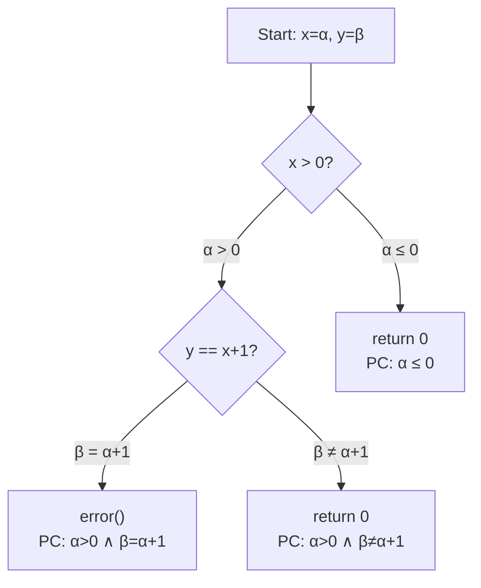
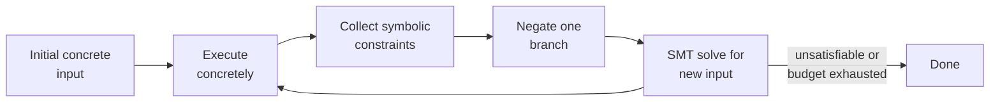

# Symbolic Execution

Symbolic execution treats program inputs as **symbolic variables** rather than concrete values, systematically exploring execution paths to find bugs and generate test inputs. It occupies a unique position on the analysis continuum: more precise than pure static analysis (it reasons about specific paths) and more systematic than testing (it explores paths methodically rather than relying on manually chosen inputs).

---

## What is Symbolic Execution?

In conventional testing, you run a program with concrete inputs (e.g., `x = 5, y = 3`) and observe the output. **Symbolic execution** instead assigns symbolic values to inputs (e.g., `x = alpha, y = beta`) and executes the program symbolically:

- **Symbolic state:** Variables hold symbolic expressions instead of concrete values (e.g., `z = alpha + beta`)
- **Path condition:** A logical formula that accumulates the constraints from each branch decision (e.g., `alpha > 0 AND beta = alpha + 1`)
- **Path forking:** At each conditional branch, execution forks into two paths -- one where the condition is true and one where it is false
- **SMT solving:** An **SMT solver** (Satisfiability Modulo Theories) such as Z3 or STP checks whether a path condition is satisfiable. If so, it produces a concrete input that exercises that path

The result: symbolic execution can automatically generate test inputs that reach specific code locations, trigger specific branches, or expose specific bugs.

---

## How It Works: Step-by-Step

Consider this simple C function:

```c
int foo(int x, int y) {
    if (x > 0) {
        if (y == x + 1) {
            // Target: generate test reaching here
            error();
        }
    }
    return 0;
}
```

A random fuzzer would struggle to find the input `y == x + 1` by chance. Symbolic execution solves it systematically.

### Symbolic Execution Tree



**Path analysis:**

| Path | Path Condition | SMT Solution | Outcome |
|------|---------------|--------------|---------|
| A to D | alpha <= 0 | x = -1, y = 0 | Returns 0 |
| A to F | alpha > 0 AND beta != alpha + 1 | x = 1, y = 0 | Returns 0 |
| A to E | alpha > 0 AND beta = alpha + 1 | **x = 1, y = 2** | **Reaches error()** |

The SMT solver finds that `alpha > 0 AND beta = alpha + 1` is satisfiable with `x = 1, y = 2`. This concrete input is a test case that reaches the `error()` call. No human had to guess the relationship between `x` and `y`.

---

## Concolic Testing: Concrete + Symbolic

Pure symbolic execution can struggle with operations that are hard to model symbolically, such as hash functions, system calls, or complex library functions. **Concolic testing** (concrete + symbolic) combines both approaches :

1. **Run the program concretely** with an initial input (e.g., `x = 0, y = 0`)
2. **Collect symbolic constraints** along the executed path
3. **Negate one branch condition** in the path constraint
4. **Solve** the modified constraint to get a new input that takes a different path
5. **Repeat** until all reachable paths are explored or a budget is exhausted

### Concolic Testing Workflow



**Pioneering tools:**
- **DART** (Godefroid, Klarlund, Sen, 2005) -- first concolic testing tool
- **CUTE** (Sen, Marinov, Agha, 2005) -- concolic unit testing engine
- **SAGE** (Godefroid et al., 2008) -- whitebox fuzz testing at Microsoft, found 1/3 of all security bugs in Windows 7 file parsers

**Advantages over pure symbolic execution:**
- Handles complex operations via concrete fallback (hashing, encryption, native calls)
- Always makes progress (each iteration explores at least one concrete path)
- No need to model the entire environment symbolically

**Disadvantages:**
- May miss paths if concrete execution diverges from symbolic model
- Path exploration order depends on initial input choice
- Still subject to path explosion for programs with many branches

---

## Key Tools

| Tool | Type | Domain | Key Feature |
|------|------|--------|-------------|
| **KLEE** | Source-level | C/C++ | High coverage, open source, LLVM-based |
| **SAGE** | Binary-level | Windows | Whitebox fuzzing at Microsoft, found critical security bugs |
| **angr** | Binary-level | Multi-architecture | Python framework, popular in CTF competitions and security research |
| **Driller** | Hybrid | Binary | Combines AFL fuzzing with angr symbolic execution |
| **SymCC** | Source-level | C/C++ | Compilation-based symbolic execution (faster than interpretation) |
| **S2E** | System-level | Full system | Analyzes entire system stacks including kernel and firmware |
| **Java PathFinder** | Source-level | Java | NASA-developed, combines model checking with symbolic execution |

---

## KLEE: Landmark Results

KLEE  demonstrated the practical power of symbolic execution in a landmark 2008 study:

### Experimental Results on GNU COREUTILS

| Metric | Result |
|--------|--------|
| Programs tested | 452 GNU COREUTILS programs |
| Median line coverage | **94.7%** |
| Programs with 90%+ coverage | Majority of the 452 programs |
| Improvement over developer tests | **+16.8%** additional coverage |
| Serious bugs found | **56** real bugs |
| Bugs undetected for 15+ years | 3 bugs in well-tested tools |
| Affected tools | Established utilities like `sort`, `cut`, `paste` |

**Significance:** KLEE's automated analysis outperformed **15 years of manually-written developer test suites** that had been maintained and extended by the open-source community. It found bugs in programs that were considered thoroughly tested and stable, demonstrating that symbolic execution can find defects that conventional testing misses.

The bugs KLEE found were not contrived edge cases -- they included buffer overflows, memory errors, and incorrect behavior triggered by specific combinations of command-line flags and input patterns.

---

## Challenges

Symbolic execution faces several fundamental challenges that limit its applicability :

### Path Explosion

The number of execution paths grows **exponentially** with the number of branches: a program with `n` independent branch points has up to `2^n` paths. A single loop executed up to `k` times multiplies paths by `k`. Real-world programs with nested loops and function calls can have astronomically many paths.

### Constraint Solving Limitations

SMT solvers handle linear arithmetic and bit-vector operations well, but struggle with:
- **Non-linear arithmetic** (multiplication of two symbolic variables)
- **Floating-point operations** (IEEE 754 semantics are complex)
- **String operations** (regex matching, concatenation constraints)
- **Cryptographic functions** (by design, these resist constraint solving)

### Environment Modeling

Programs interact with the operating system, file system, network, and libraries. Symbolic execution must either:
- **Model** these interactions (build symbolic stubs -- labor-intensive, incomplete)
- **Concretize** them (use real values -- loses symbolic precision)
- **Ignore** them (unsound -- may miss bugs or explore infeasible paths)

### Scalability

Analysis time grows with program size and path count. Symbolic execution of a small utility (hundreds of LOC) can take minutes; analysis of a large application (millions of LOC) may not terminate within practical time budgets.

### Mitigation Strategies

| Strategy | How It Helps | Example |
|----------|-------------|---------|
| **Scope reduction** | Analyze functions or modules, not whole programs | Unit-level symbolic execution |
| **Search heuristics** | Prioritize paths likely to reach uncovered code or trigger bugs | Coverage-optimized search in KLEE |
| **Hybrid analysis** | Combine with fuzzing: use fuzzing for easy paths, symbolic execution for hard-to-reach branches | Driller (AFL + angr) |
| **Compositional analysis** | Summarize functions symbolically, reuse summaries at call sites | Compositional symbolic execution |
| **Selective symbolic execution** | Keep most variables concrete, only symbolize interesting inputs | S2E approach |

---

## Relationship to Static Analysis and Testing

Symbolic execution occupies a unique position on the analysis continuum:

| Dimension | Pure Static Analysis | Symbolic Execution | Dynamic Testing |
|-----------|---------------------|-------------------|-----------------|
| **Inputs** | All (abstract) | Symbolic (forked per path) | Concrete (specific values) |
| **Paths explored** | All (approximated) | Some (systematically selected) | One per test case |
| **Precision** | Lower (over-approximation) | High (per-path exact) | Exact (for that input) |
| **Coverage guarantee** | All code analyzed | Paths within budget | Only executed paths |
| **False positives** | Yes (conservative) | Rare (path conditions verified) | None (observed behavior) |
| **Automation** | Fully automatic | Fully automatic | Requires test design |

**Compared with fuzzing**, symbolic execution is guided by program structure rather than random mutation. A fuzzer might spend hours trying random inputs without discovering that `y` must equal `x + 1`, while symbolic execution solves this constraint directly. However, fuzzers are faster per execution and handle complex environments more naturally.

**Hybrid fuzzing** combines both strengths: use fast fuzzing for broad coverage, switch to symbolic execution when the fuzzer gets stuck at complex branch conditions. This approach is the current state of the art for automated vulnerability detection .

---

## Further Exploration

- [Dataflow Analysis](dataflow.md) -- Tracking variable states through program paths using abstract domains
- [Analysis Techniques](techniques.md) -- The full spectrum from lexical analysis to abstract interpretation
- [Static Analysis Overview](./) -- Foundational concepts including the soundness-completeness tradeoff
- [V&V Overview](../overview/) -- The broader landscape of verification and validation techniques

---

### References



---

{: .highlight }
**Disclaimer:** AI is used for text summarization, polishing and explaining. Authors have verified all facts and claims. In case of an error, feel free to file an issue.
