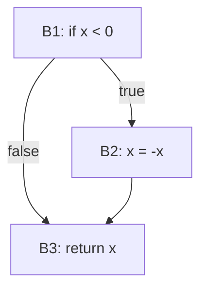

# Analysis Techniques

Static analysis encompasses a range of techniques that differ in what program representation they analyze, how deeply they reason about behavior, and what kinds of defects they can detect. This page covers the foundational techniques that underlie modern static analysis tools .

---

## Technique Overview

| Technique | What It Analyzes | Precision | Cost | Example Tools |
|-----------|-----------------|-----------|------|---------------|
| Lexical / Style | Token patterns | Low | Very Low | ESLint, Pylint, RuboCop |
| AST Pattern Matching | Code structure (syntax tree) | Medium | Low | PMD, SpotBugs, Semgrep |
| Type Checking | Type annotations and inference | High | Low | TypeScript, mypy, Flow |
| Control Flow Analysis | Execution paths (CFG) | Medium | Medium | Compiler warnings, Coverity |
| Dataflow Analysis | Variable states through paths | Medium-High | Medium | Infer, Clang Static Analyzer |
| Taint Analysis | Data flow from source to sink | Medium | Medium | CodeQL, Fortify, Checkmarx |
| Abstract Interpretation | Program semantics over abstract domains | High | High | Polyspace, Astree |

Each technique trades off depth of analysis against computational cost and the ability to scale to large codebases. A comparison of six Java static analysis tools found less than 0.4% agreement at the line level, confirming that different techniques detect fundamentally different defect types .

---

## Lexical Analysis and Style Checking

The simplest form of static analysis operates on the raw text or token stream of source code, without parsing it into a tree structure.

**What it detects:**
- Code formatting violations (indentation, spacing, line length)
- Naming convention violations (camelCase vs. snake_case)
- Use of banned functions or deprecated APIs
- Comment quality and documentation coverage

**How it works:**
Pattern matching on tokens or regular expressions applied to source lines. No understanding of program semantics -- the analysis treats code as text.

**Tools:** ESLint (JavaScript), Pylint (Python), RuboCop (Ruby), Checkstyle (Java)

**Strengths and limitations:**

| Strength | Limitation |
|----------|-----------|
| Extremely fast | Cannot understand program behavior |
| Easy to configure | High false positive rate for complex rules |
| Language-agnostic patterns possible | Misses semantic bugs entirely |
| Low barrier to adoption | Limited to surface-level issues |

Lexical analysis is the foundation of every linter and is typically the first static analysis technique adopted by a project.

---

## AST Pattern Matching

A step deeper than lexical analysis, AST (Abstract Syntax Tree) pattern matching parses source code into a tree representation and matches subtrees against known bug patterns .

**What it detects:**
- Known bug patterns (null comparisons after dereference, double-checked locking)
- Misuse of APIs (incorrect argument order, missing null checks)
- Common coding mistakes (equality vs. assignment, fall-through in switch)
- Unused variables, unreachable code, empty catch blocks

**How it works:**
1. Parse source code into an AST
2. Walk the tree looking for subtree patterns that match known bugs
3. Report matches with location and description

**Example -- Double-checked locking (Java):**
```java
// Broken double-checked locking pattern
if (instance == null) {
    synchronized (lock) {
        if (instance == null) {
            instance = new Singleton(); // May be reordered!
        }
    }
}
```

A tool like SpotBugs (formerly FindBugs) recognizes this AST pattern and flags it because the Java Memory Model allows instruction reordering that can expose a partially constructed object.

**Tools:** PMD (Java, multi-language), SpotBugs (Java bytecode), Semgrep (multi-language, custom rules)

---

## Type Checking

Static type systems verify that operations are applied to compatible data types at compile time, catching an entire class of errors before the program runs.

**What it detects:**
- Type mismatches (passing a string where an integer is expected)
- Null/undefined reference errors (with null-safe type systems)
- Missing interface implementations
- Incorrect generic type usage

**Modern null safety:**

Languages like Kotlin, Swift, and modern TypeScript distinguish nullable from non-nullable types at the type level:

```typescript
// TypeScript strict null checks
function greet(name: string): string {
    return "Hello, " + name;  // 'name' guaranteed non-null
}

function greetMaybe(name: string | null): string {
    // return "Hello, " + name;  // Error: 'name' might be null
    return name ? "Hello, " + name : "Hello, stranger";
}
```

**Gradual typing** (TypeScript, mypy for Python, Flow for JavaScript) allows teams to incrementally add type annotations to existing codebases, getting increasing type safety without rewriting.

---

## Control Flow Analysis

Control flow analysis constructs a **Control Flow Graph (CFG)** -- a directed graph where nodes represent basic blocks (sequences of statements with no branches) and edges represent possible transfers of control.

**What it detects:**
- Unreachable code (dead code after unconditional return or break)
- Missing return statements on some paths
- Infinite loops
- Missing error handling on exception paths

**CFG construction example:**

Consider this function:

```python
def abs_value(x):
    if x < 0:       # Block B1: condition
        x = -x      # Block B2: then branch
    return x         # Block B3: exit
```



The CFG makes control flow explicit. Static analysis algorithms traverse this graph to reason about what happens on each path. For instance, if `B3` were unreachable from any predecessor, the tool would flag dead code.

**Applications:**
- **Unreachable code detection**: Find blocks with no incoming edges (except the entry block)
- **Loop analysis**: Identify natural loops, detect unbounded loops
- **Exception flow**: Track which exceptions can propagate to which handlers
- **Resource leak detection**: Verify that resources opened on one path are closed on all paths

---

## Taint Analysis

Taint analysis tracks the flow of untrusted data from **sources** (user input, network, files) to security-sensitive **sinks** (SQL queries, shell commands, HTML output) .

**The core idea:**
1. **Sources** introduce tainted data (e.g., `request.getParameter("id")`)
2. **Propagation rules** define how taint flows through operations (e.g., string concatenation preserves taint)
3. **Sanitizers** remove taint (e.g., `escapeHtml()`, parameterized queries)
4. **Sinks** are dangerous if reached by tainted data (e.g., `executeQuery(sql)`)

If tainted data reaches a sink without passing through an appropriate sanitizer, the tool reports a vulnerability.

**Common vulnerability patterns:**

| Vulnerability | Source | Sink | Sanitizer |
|---------------|--------|------|-----------|
| SQL Injection | HTTP parameter | SQL query | Parameterized query |
| Cross-Site Scripting (XSS) | User input | HTML output | `escapeHtml()` |
| Command Injection | User input | `exec()` / `system()` | Input validation |
| Path Traversal | URL parameter | File open | Path canonicalization |

**Example -- SQL injection:**

```java
// VULNERABLE: tainted data flows directly to sink
String id = request.getParameter("id");           // Source (tainted)
String sql = "SELECT * FROM users WHERE id=" + id; // Propagation
stmt.executeQuery(sql);                            // Sink - ALERT!

// SAFE: sanitizer (parameterized query) removes taint
String id = request.getParameter("id");           // Source (tainted)
PreparedStatement ps = conn.prepareStatement(
    "SELECT * FROM users WHERE id=?");
ps.setString(1, id);                              // Sanitizer
ps.executeQuery();                                // Sink - OK
```

**Taint propagation rules** are critical for accuracy. If the rules are too conservative (everything is tainted), the tool produces too many false positives. If too permissive (taint lost through wrappers), it misses real vulnerabilities.

Modern tools like **CodeQL** (GitHub) and **Semgrep** allow users to define custom taint specifications, adapting the analysis to project-specific frameworks and sanitization patterns.

---

## Choosing Techniques

No single technique is sufficient. The choice depends on the project's risk profile and resources:

| Project Context | Recommended Techniques |
|-----------------|----------------------|
| Any project (baseline) | Linting + type checking |
| Web application | Add taint analysis for injection vulnerabilities |
| Safety-critical system | Add dataflow analysis + abstract interpretation |
| Concurrent/distributed | Add model checking for deadlock/race conditions |
| Large codebase (millions of LOC) | Platform approach: combine multiple lightweight analyzers  |

The key principle is **defense in depth**: layer multiple techniques, each catching different defect classes, rather than relying on a single deep analysis.

---

## Further Exploration

- [Static Analysis Overview](./) -- Why static analysis matters and the soundness-completeness tradeoff
- [V&V Overview](../overview/analysis/) -- Foundational definitions and properties
- [Test Coverage Criteria](../coverage/) -- How dynamic testing measures thoroughness

---

### References



---

{: .highlight }
**Disclaimer:** AI is used for text summarization, polishing and explaining. Authors have verified all facts and claims. In case of an error, feel free to file an issue.
